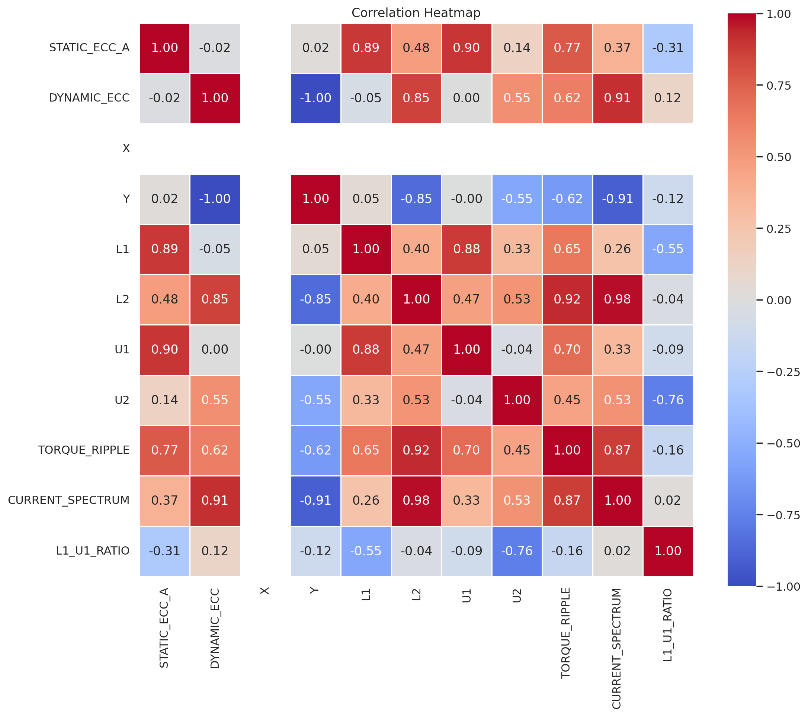
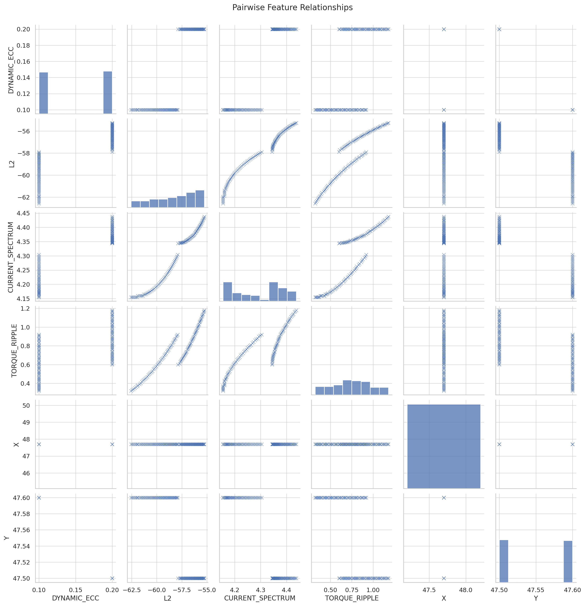
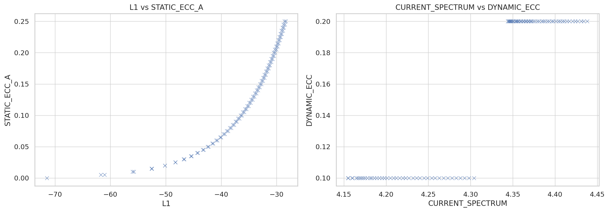
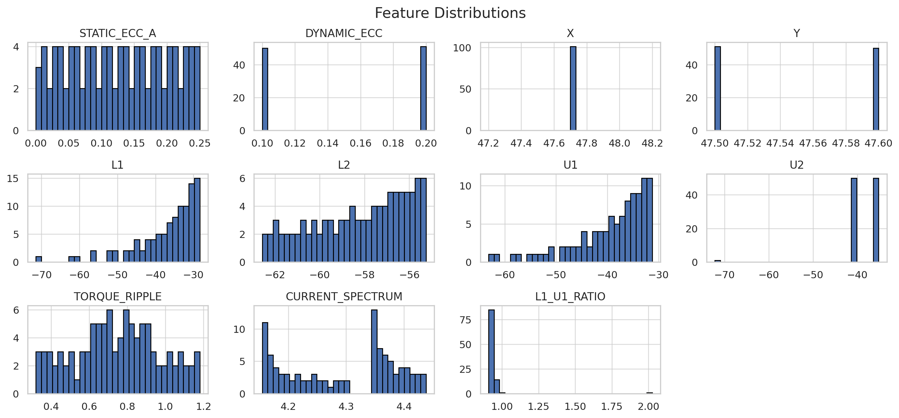
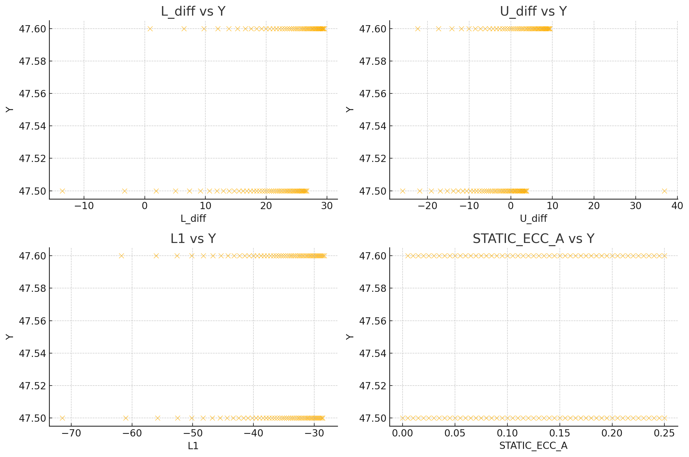
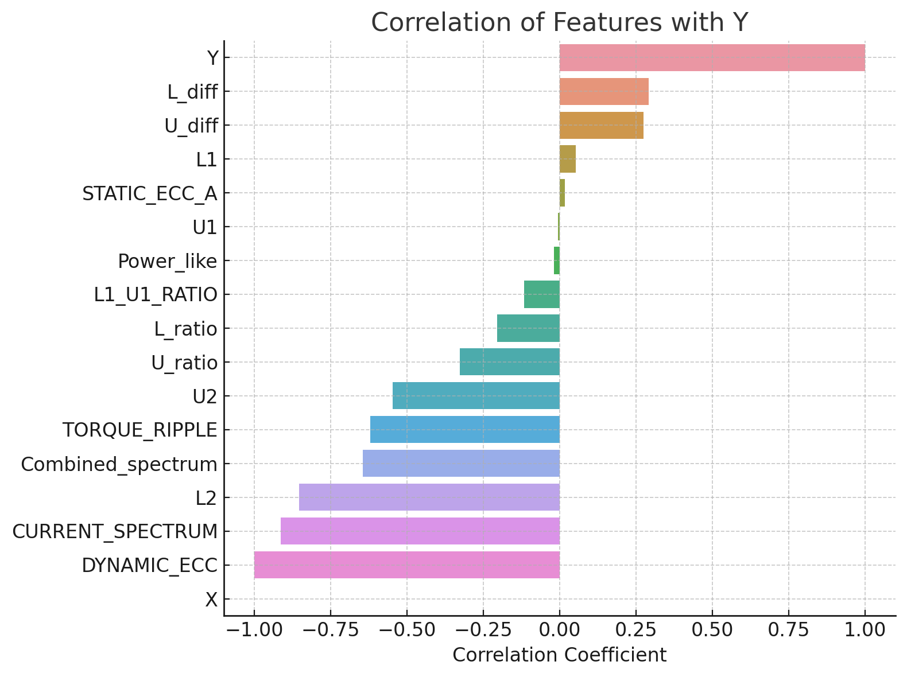

# StaticDynamic
### Eccentricity Prediction

Disclaimer:  
This project is still under development and the current results are exploratory. Final conclusions and production-level decisions should wait until further improvements, testing, and validations are complete.

---

## Objective

To predict Static Eccentricity (`STATIC_ECC_A`) and Dynamic Eccentricity (`DYNAMIC_ECC`) in a motor system using measured electrical and mechanical parameters such as voltages (`L1`, `L2`, `U1`, `U2`), `TORQUE_RIPPLE`, and `CURRENT_SPECTRUM`.

---
## Data Analysis Visualizations

### 1. Correlation Heatmap
This heatmap shows how strongly each input feature correlates with the target variables (`STATIC_ECC_A` and `DYNAMIC_ECC`). It helps in selecting the most impactful predictors.

---

### 2. Pairwise Feature Relationships
This matrix of scatter plots highlights the interdependencies and trends among key input features and target variables.

---

### 3. Scatter Plot: L1 vs STATIC_ECC_A
A clear curve is observed between `L1` and `STATIC_ECC_A`, confirming the strong predictive relationship used in model 1.

---

### 4. Scatter Plot: CURRENT_SPECTRUM vs DYNAMIC_ECC
This plot shows a more limited but noticeable trend — some dependency of `DYNAMIC_ECC` on `CURRENT_SPECTRUM`.

---

## Real-World Significance and Applications

Electric motors are critical components in modern industrial, automotive, and consumer systems. Predicting and monitoring **eccentricity faults** in these motors—particularly **static** and **dynamic eccentricity**—is crucial for maintaining performance, reducing downtime, and preventing catastrophic failure.

### What is Eccentricity?

- **Static Eccentricity** occurs when the rotor is displaced but does not rotate around the stator center. It leads to asymmetrical magnetic fields and performance degradation.
- **Dynamic Eccentricity** occurs when the rotor rotates around a point that is not the geometric center, often due to wear, misalignment, or imbalance.

---

### Why Predict Eccentricity?

Traditional methods for detecting these faults involve:
- Manual inspection
- Vibration monitoring
- Costly hardware sensors or test benches

These methods are often:
- Reactive (only detect after fault has worsened)
- Time-consuming
- Expensive

---

### How This Model Helps

The models developed in this project offer a **data-driven, predictive alternative** that uses **electrical measurements already available** during motor operation, such as:
- Phase voltages and currents (`L1`, `L2`, `U1`, `U2`)
- Torque ripple
- Frequency spectrum of the current

#### Benefits:

1. **Non-Invasive Monitoring**  
   No need for physical disassembly or additional sensors.

2. **Early Fault Detection**  
   Enables preventive maintenance, reducing unexpected breakdowns.

3. **Cost-Effective**  
   Uses existing operational data—no additional hardware needed.

4. **Real-Time Capability**  
   Once deployed, models can predict eccentricity values continuously or periodically.

5. **Scalability**  
   Can be embedded into edge devices or integrated into PLC-based automation systems for live health monitoring.

---

### Use Cases:

- **Factory Floor Monitoring**: Embed the model in a PLC or edge gateway to monitor motor health in real-time.
- **Electric Vehicle Motors**: Predict rotor misalignment before it impacts performance or causes heating.
- **HVAC & Pumps**: Automate motor diagnostics to minimize energy loss and avoid shaft damage.
- **Predictive Maintenance Dashboards**: Integrate outputs into existing SCADA systems or dashboards for alerting and maintenance planning.

---

## Completed Work

### 1. Data Cleaning & Preparation
- Raw Excel and CSV files were imported, cleaned, and standardized.
- Columns like `Drop`, `TR_PCT`, `%STATIC_ECC`, `%DYNAMIC_ECC`, etc., were dropped.
- Nulls and faulty rows were removed.
- Data saved as: `data_clean_with_xy.csv` and `test_clean.csv`.

---

### 2. Feature Engineering
We created additional features to capture non-linear relationships:
- `L_diff = L1 - L2`
- `U_diff = U1 - U2`
- `L_ratio = L1 / L2`
- `U_ratio = U1 / U2`
- `Power_like = L1 * U1`
- `Combined_spectrum = CURRENT_SPECTRUM * TORQUE_RIPPLE`

These were added to both training and test datasets.

---

### 3. Model 1: STATIC_ECC_A Prediction
- Model Used: XGBoost Regressor
- Inputs: `L1`, `L1_U1_RATIO`
- Performance:
  - RMSE: ~0.004
  - R²: ~0.99
- Conclusion: Very high accuracy; model generalizes well.

---

### 4. Model 2a: DYNAMIC_ECC Direct Prediction
- Model Used: XGBoost Regressor
- Inputs: `L2`, `TORQUE_RIPPLE`, `CURRENT_SPECTRUM`
- Performance:
  - RMSE: ~0.02
  - R²: ~0.81
- Observations:
  - The model learns patterns and reacts to changes.
  - Still shows underprediction in early samples, but improves later.

---

### 5. Model 2b: DYNAMIC_ECC via Predicted Y
- Idea: Predict `Y` using engineered features, then calculate:
  DYNAMIC_ECC = 47.7 - Y_pred
- Model Used: XGBoost Regressor (`model_y.pkl`)
- Inputs: `U1`, `U2`, `L1`, `Power_like`, `U_diff`
- Performance:
  - RMSE: ~0.0218
  - R²: ~0.81
  - But predictions were flat – model failed to react to feature variation.
- Conclusion: Underfit and not viable yet.

This bar plot shows the Pearson correlation of each engineered feature with the intermediate variable `Y`.  
It helps prioritize the most relevant inputs for training the `model_y.pkl` regressor.

---

Visualizes relationships between selected engineered features and `Y`.  
Used to verify whether feature trends align with correlation coefficients.

Included:
- `L_diff vs Y`
- `U_diff vs Y`
- `L1 vs Y`
- `STATIC_ECC_A vs Y`

---

## Visual Analysis

- Static ECC predictions matched actuals closely with small, uniform residuals.
- Dynamic ECC predictions (via Y) were flat, underfitting the range.
- Direct prediction of DYNAMIC_ECC showed better dynamic response.

---

## Limitations

1. Limited Training Data:
   - Most samples had `Y ≈ 47.6` leading to flat predictions.

2. Underfitting in `model_y`:
   - Caused consistently flat outputs.

3. Lack of balanced value distribution:
   - The model has not seen enough samples for DYNAMIC_ECC values like 0.15, 0.175, etc.

4. No cross-validation or hyperparameter tuning done yet:
   - All models used default XGBRegressor settings.

---

## Next Steps

| Priority | Task |
|----------|------|
| High     | Collect more data with varied `Y` / `DYNAMIC_ECC` values |
| Medium   | Try classification for `DYNAMIC_ECC` if values are discrete |
| Medium   | Use GridSearchCV or Optuna for model tuning |
| Low      | Use SHAP or permutation importance to analyze feature impact |
| Medium   | Validate models using cross-validation and additional test sets |

---

## Key Artifacts

| File                     | Description                                 |
|--------------------------|---------------------------------------------|
| `data_clean_with_xy.csv` | Cleaned training data with engineered features |
| `test_clean.csv`         | Cleaned test set for inference              |
| `model_static_xgb.pkl`   | Model to predict `STATIC_ECC_A`             |
| `model_y.pkl`            | Model to predict `Y` (used for `DYNAMIC_ECC`) |

---

Last updated: June 9, 2025
